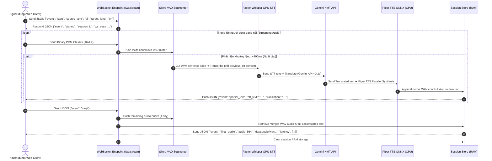

# Tài liệu Thiết kế Kiến trúc WebSocket Streaming Voice Translate (Perceived Latency)

## 1. Tóm tắt Yêu cầu & Mục tiêu (Understanding Summary)

* **Mục tiêu:** Tối ưu độ trễ nhận diện và tổng hợp tiếng nói cho luồng dịch giọng nói thời gian thực. Đạt thời gian chờ cảm nhận (Perceived Playback Delay) ngay sau khi người dùng nhả nút dừng thu âm.
* **Vấn đề đã giải quyết:**
  * Khắc phục việc phải chờ thu hết toàn bộ audio rồi mới bắt đầu xử lý tuần tự (STT ➔ NMT ➔ TTS).
  * Chuyển sang mô hình **Pipelining theo từng vế câu**: Silero VAD tự động ngắt câu theo khoảng lặng (>400ms), đẩy từng đoạn audio nhỏ vào Pipeline xử lý ngầm trong khi người dùng vẫn đang nói.
  * Ghép nối sẵn các chunk âm thanh WAV tổng hợp trong RAM (`session_store.py`) để phát ngay lập tức khi người dùng kết thúc câu phát biểu.
* **Môi trường & Công nghệ:**
  * **STT:** Faster-Whisper GPU CUDA (`float16`, model `large-v3-turbo`) + Silero VAD + GPU Warmup.
  * **NMT:** Google Gemini API (`gemini-3.5-flash-lite`) với thời gian phản hồi ~0.2s + TLS Warmup.
  * **TTS:** Piper Local TTS ONNX Runtime (CPU multi-threaded, parallel sentence synthesis).
  * **Public Tunnel:** Cloudflare Quick Tunnel (`cloudflared`) tự động mở HTTPS/WSS public khi chạy `python run.py --public`.

---

## 2. Các Giả định (Assumptions)

1. Trình duyệt client thu âm PCM 16kHz Mono 16-bit và gửi trực tiếp các binary chunk qua kết nối WebSocket `/ws/stream`.
2. Mô hình Faster-Whisper giữ cấu hình `beam_size=1` (Greedy Search) kết hợp Context Conditioning tiêm văn bản đã phát biểu trước đó để duy trì mạch ý.
3. Server quản lý trạng thái từng phiên kết nối bằng `session_store.py` lưu giữ văn bản tích lũy và danh sách âm thanh WAV chunk trong bộ nhớ RAM.

---

## 3. Nhật ký Quyết định (Decision Log)

| STT | Quyết định | Phương án thay thế | Lý do chọn |
| :---: | :--- | :--- | :--- |
| **1** | **WebSocket Duplex Pipeline (`/ws/stream`)** | HTTP POST Request tuần tự | Loại bỏ thời gian chờ thu toàn bộ audio, cho phép xử lý nối tiếp ngầm từng vế câu khi người dùng đang nói. |
| **2** | **Silero VAD (Silence > 400ms)** | Cắt audio cố định theo khoảng thời gian (chunk 2s) | Cắt câu tự nhiên theo nhịp thở/ngắt nghỉ của người nói, hạn chế việc cắt đôi từ ngữ làm sai STT. |
| **3** | **Piper Local TTS ONNX Engine** | Edge-TTS / Google Cloud TTS | **100% Offline**, 0 MB VRAM, tổng hợp câu song song trên 6 worker threads CPU, tránh bị nghẽn mạng hay giới hạn API rate limit. |
| **4** | **RAM Audio Pre-Buffering (`session_store.py`)** | Chờ bấm Stop mới tổng hợp file WAV | Nối sẵn các chunk WAV trong bộ nhớ tạm RAM, khi nhả mic nhả ngay file audio hoàn chỉnh chỉ trong **< 0.1s**. |
| **5** | **Cloudflare Quick Tunnel (`cloudflared`)** | Ngrok Paid Subdomains | **100% Miễn phí**, không cần đăng ký tài khoản, tự động mở link HTTPS + Secure WSS công khai khi chạy `python run.py --public`. |
| **6** | **Automated Server Warmup (CUDA & TLS)** | Bỏ qua bước Warmup | Loại bỏ hoàn toàn độ trễ trễ gấp 2-3 lần ở lượt dịch đầu tiên (Cold Start Latency). |

---

## 4. Thiết kế Kiến trúc Chi tiết (Final Design)

### 4.1 Sơ đồ Luồng Dữ liệu (Data Flow Diagram)

---

### 4.2 Giao thức Truyền thông WebSocket (WebSocket Event Protocols)

| Hướng | Tên Event | Dữ liệu đính kèm (Payload) | Mô tả |
| :---: | :---: | :--- | :--- |
| **Client ➔ Server** | `start` | `{"event": "start", "source_lang": "vi", "target_lang": "en"}` | Khởi tạo phiên stream mới |
| **Server ➔ Client** | `started` | `{"event": "started", "session_id": "ws_sess_170000000"}` | Xác nhận phiên stream đã sẵn sàng |
| **Client ➔ Server** | *(Binary)* | PCM Audio Bytes (16kHz Mono 16-bit) | Stream dữ liệu âm thanh trực tiếp từ mic |
| **Server ➔ Client** | `partial_text` | `{"event": "partial_text", "stt_text": "...", "translation": "..."}` | Cập nhật văn bản nhận diện và bản dịch tích lũy |
| **Client ➔ Server** | `stop` | `{"event": "stop"}` | Kết thúc lượt nói và yêu cầu xuất audio dịch hoàn chỉnh |
| **Server ➔ Client** | `final_audio` | `{"event": "final_audio", "audio_b64": "data:...", "latency": {...}}` | Trả về file âm thanh đã nối sẵn + thông số độ trễ |
| **Client ➔ Server** | `ping` | `{"event": "ping"}` | Kiểm tra kết nối |
| **Server ➔ Client** | `pong` | `{"event": "pong"}` | Phản hồi kiểm tra kết nối |

---

## 5. Xử lý Lỗi & Trường hợp biên (Error Handling)

1. **WebSocket Disconnect Đột ngột:**
   - Server tự động bắt ngoại lệ `WebSocketDisconnect` và gọi `session_store.clear_session(session_id)` để giải phóng toàn bộ dữ liệu RAM tránh rò rỉ bộ nhớ.
2. **Âm thanh Không rõ / Nhiễu môi trường:**
   - Silero VAD lọc loại bỏ các đoạn âm thanh rác. Nếu Whisper STT trả về chuỗi rỗng (`""`), worker ngầm bỏ qua không gọi NMT/TTS.
3. **Quản lý RAM Session Store:**
   - Bộ nhớ tạm RAM lưu giữ danh sách các byte WAV riêng biệt của từng vế câu và tự động dọn dẹp ngay sau khi event `final_audio` được gửi đi.
