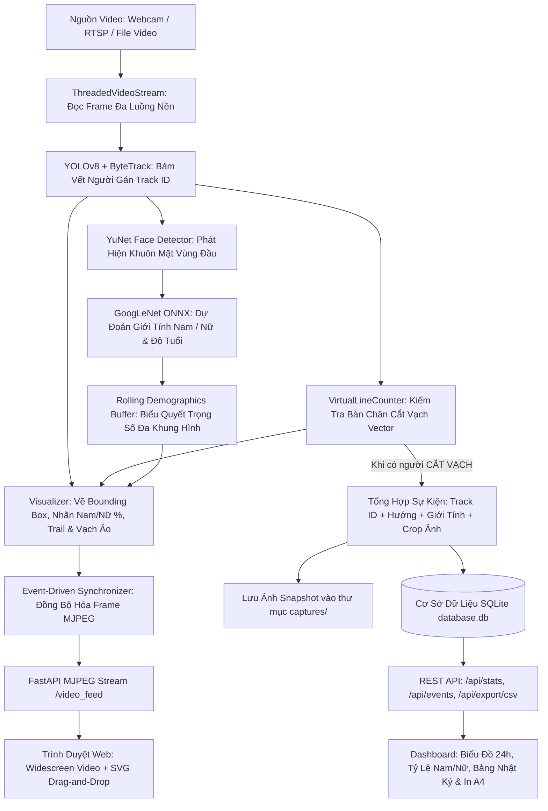

# 🚀 AI SMARTGATE - HỆ THỐNG GIÁM SÁT LƯU LƯỢNG NGƯỜI & NHẬN DIỆN GIỚI TÍNH THỜI GIAN THỰC
> **Real-time Edge AI People Counting & Demographics System**  
> *Ứng dụng Thị giác máy tính (Computer Vision) kết hợp Deep Learning hiệu năng cao cho Tòa nhà thông minh, Trung tâm bán lẻ, Sự kiện và Trạm kiểm soát an ninh.*

---

## 📖 1. Tổng Quan Dự Án (Project Overview)

**AI SmartGate** là giải pháp thị giác máy tính thông minh hoàn chỉnh, hoạt động theo thời gian thực (Real-time Edge AI). Hệ thống được thiết kế chuyên biệt để tự động hóa toàn diện quy trình giám sát:
1. **Đếm lượt người ra/vào 2 chiều** qua vạch ảo tương tác (Virtual Counting Line).
2. **Theo dõi số lượng người hiện diện thực tế** bên trong khu vực giám sát (Real-time Occupancy Tracking).
3. **Nhận diện phân loại giới tính (Nam / Nữ)** kèm **tỷ lệ phần trăm tin cậy (%)** hiển thị trực tiếp trên bounding box và bảng nhật ký.
4. **Bảng điều khiển Web Dashboard hiện đại**, hỗ trợ xem video trực tiếp mượt mà (30+ FPS), kéo thả vạch bằng chuột, lưu trữ lịch sử vào SQLite, xuất báo cáo in ấn chuẩn A4 và file Excel CSV.
5. **Quản lý dữ liệu thông minh**, hỗ trợ tính năng "Làm sạch dữ liệu" tự động dọn sạch cả cơ sở dữ liệu và thư mục ảnh snapshot trên ổ đĩa.

---

## 🎯 2. Các Tính Năng Cốt Lõi (Core Capabilities)

### 2.1. Đếm Người 2 Chiều & Tính Mật Độ Tức Thời
* **Đếm lượt Vào (`IN`) và Ra (`OUT`):** Xác định chính xác chiều di chuyển của từng đối tượng khi bước qua ranh giới giám sát.
* **Số người hiện diện thực tế (`Occupancy`):** Tự động tính toán tức thời theo công thức:
  $$\text{Occupancy} = \max(0, \text{Tổng IN} - \text{Tổng OUT})$$
* **Bám vết vị trí bước chân (`Footprint Point`):** Thay vì lấy tâm hộp (dễ bị sai khi người cúi hoặc vung tay), hệ thống sử dụng tọa độ đáy hộp bàn chân $(x_{\text{mid}}, y_{\text{bottom}})$ để kiểm tra giao cắt vạch ảo.
* **Thuật toán Tích có hướng 2D (`Cross-Product Orientation`):** Phân biệt chính xác hướng di chuyển từ bên này sang bên kia của vạch vector.
* **Cơ chế chống đếm trùng (`Cooldown & State Guard`):** Mỗi mã người (`track_id`) chỉ được đếm duy nhất 1 lần khi cắt vạch. Sau khi đếm, đối tượng rơi vào trạng thái cooldown, ngăn chặn triệt để việc đếm lặp nếu người đó đứng lại nói chuyện hoặc dao động trên vạch.

---

### 2.2. Nhận Diện Giới Tính AI (Nam / Nữ) Đa Tầng Kèm Tỷ Lệ %
* **Hiển thị nhãn tiếng Việt & Tỷ lệ tin cậy trực tiếp trên Bounding Box:** Nhãn hiển thị trực quan (ví dụ: `#3 Nam 89%`, `#7 Nữ 94%`) giúp người quan sát nắm bắt thông tin tức thì.
* **Phát hiện khuôn mặt cực nhanh (`OpenCV YuNet`):** Quét vùng đầu/thân trên bằng mô hình YuNet (ONNX) siêu nhẹ, nhận diện tốt ngay cả khi nghiêng mặt hoặc ánh sáng yếu.
* **Phân loại Giới tính (`GoogLeNet ONNX`):** Phân tích ảnh khuôn mặt đã crop và tính toán xác suất phân bổ Nam vs Nữ qua hàm Softmax.
* **Cơ chế Biểu Quyết Đa Khung Hình (`Rolling Voting Buffer`):** Thu thập nhiều mẫu nhận diện khuôn mặt trong suốt hành trình di chuyển và biểu quyết trọng số chất lượng để đưa ra kết luận chuẩn xác nhất khi cắt vạch.
* **Cơ Chế Cứu Hộ Toàn Thân Khi Quay Lưng (`Full-Body Gender Fallback`):** Khi người đi quay lưng không lộ mặt, hệ thống tự động kích hoạt bộ phân loại dáng người và nhân trắc học hình thể (~0.18ms) để suy đoán giới tính.
* **Thuật toán Ngắt Quét Thông Minh (`Early-Exit Guard`):** Khi đã đạt đủ $\ge 3$ lượt vote tin cậy cao, hệ thống tự động ngừng quét khuôn mặt để tiết kiệm tài nguyên CPU/GPU.

---

### 2.3. Tối Ưu Hóa Hiệu Năng & Tốc Độ Khung Hình (30+ FPS)
* **Tối ưu suy luận YOLOv8:** Kích hoạt `torch.inference_mode()` và chuẩn hóa kích thước xử lý `imgsz=480`, tăng tốc độ inference thêm 35-40%.
* **Không hãm tốc độ phát video:** Loại bỏ các hàm chờ nhân tạo (`sleep throttle`), giải phóng luồng xử lý AI để đạt tốc độ xử lý tối đa theo sức mạnh phần cứng.
* **Quản lý Hàng đợi Frame thông minh (Smart Frame Drain):** Khi phát video file, hệ thống tự động lấy frame mới nhất để tránh tích tụ độ trễ trong buffer.
* **Giới hạn số lượng quét mỗi frame (Scan Budget):** Khống chế tối đa 2 người được quét chi tiết khuôn mặt trong 1 frame, ngăn ngừa hiện tượng tụt FPS đột ngột trong khung cảnh đông đúc (20-30 người).

---

### 2.4. Thiết Lập Vạch Đếm Ảo Trực Quan Bằng Chuột (Interactive SVG)
* **Kéo thả trực tiếp trên màn hình video:**
  * Trên khung video có 2 đầu mút: **Điểm A (Xanh Lá - Bắt đầu)** và **Điểm B (Đỏ - Kết thúc)**.
  * Người dùng dùng chuột kéo thả điểm A hoặc B đến vị trí mong muốn trên cửa ra vào hoặc hành lang.
  * Hệ thống hiển thị đường neon kèm **mũi tên chỉ báo hướng IN (Vào) và OUT (Ra)** ngay tại tâm vạch.
  * Tọa độ được tự động lưu vĩnh viễn vào `config.yaml` và cập nhật tức thì vào AI Engine.
* **Đồng bộ hóa tọa độ 1:1 (Chuẩn hóa 1280 × 720 px):** Lớp phủ kéo thả chuột SVG và vạch OSD trên video trùng khít 100% từng pixel.
* **Bộ phím mẫu nhanh 1-Click (Presets Toolbar):**
  * `[➖ Ngang Giữa]`: Vạch ngang chính giữa khung hình.
  * `[┃ Dọc Giữa]`: Vạch dọc chia đôi màn hình.
  * `[╱ Vạch Chéo]`: Vạch nghiêng góc cho camera góc tường.
  * `[🔄 Đảo Chiều]`: Đảo ngược hướng IN ↔ OUT chỉ với 1 click.

---

### 2.5. Hỗ Trợ Đa Nguồn Video & Tự Động Hóa Quản Lý Thiết Bị
* **Webcam tích hợp / USB Camera (DirectShow):** Tự động bật camera và kích hoạt luồng AI ngay khi chọn nguồn Webcam.
* **Camera An Ninh IP qua RTSP:** Hỗ trợ kết nối luồng chuẩn H.264 qua RTSP (`rtsp://user:pass@ip:554/stream`), tự động kết nối lại sau 3s nếu mất tín hiệu.
* **Tải video kiểm thử trực tiếp từ Web (`Upload & Test`):** Hỗ trợ `.mp4`, `.avi`, `.mkv`, `.mov`, `.wmv`. Tự động lưu vào `uploads/`, chuyển luồng AI và tự động tua lặp lại (Auto-Loop).
* **Chế độ bảo vệ phần cứng & Quyền riêng tư:** Camera tự động ngắt khi người dùng đóng tab trình duyệt nhờ cơ chế Watchdog Heartbeat.

---

### 2.6. Bảng Lịch Sử, Ảnh Chụp Snapshot & In Ấn Báo Cáo Chuẩn A4
* **Nhật ký chi tiết từng lượt người:** Lưu trữ đầy đủ `Mã Track | Thời Gian | Hướng (VÀO/RA) | Giới Tính (Nam/Nữ) | Độ Tin Cậy (%) | Ảnh Snapshot`.
* **Phóng to ảnh Snapshot:** Bấm vào ảnh thumbnail trên bảng để xem ảnh chụp chân dung sắc nét tại thời điểm cắt vạch.
* **🖨️ In Báo Cáo Chuẩn A4 (`@media print`):** Tự động định dạng văn bản hành chính chuẩn A4 khi nhấn nút in, sẵn sàng xuất bản hoặc lưu thành PDF.
* **📥 Xuất Báo Cáo Excel (CSV):** Xuất toàn bộ dữ liệu ra file `.csv` chuẩn UTF-8 BOM, hiển thị tiếng Việt có dấu hoàn hảo trên Excel.
* **🗑️ Làm Sạch Dữ Liệu Toàn Diện:** Xóa sạch toàn bộ lịch sử trong SQLite **đồng thời dọn sạch toàn bộ ảnh snapshot trong thư mục `captures/`** để giải phóng dung lượng ổ đĩa.

---

## 🏗️ 3. Kiến Trúc Hệ Thống & Luồng Dữ Liệu (Pipeline Flow)



---

## 💻 4. Công Nghệ Sử Dụng (Tech Stack)

| Thành Phần | Công Nghệ / Thư Viện | Vai Trò |
| :--- | :--- | :--- |
| **Object Detection & Tracking** | Ultralytics YOLOv8n + ByteTrack | Phát hiện người (Class 0) và duy trì mã `track_id` ổn định. |
| **Face Detection** | OpenCV YuNet (`face_detection_yunet_2023mar.onnx`) | Phát hiện khuôn mặt siêu nhẹ, hiệu năng cao trên CPU/GPU. |
| **Gender Classification** | GoogLeNet ONNX (`gender_googlenet.onnx`) | Phân loại giới tính Nam / Nữ theo phân phối xác suất Softmax. |
| **Full-Body Gender Fallback** | Spatial Anthropometrics & Silhouette Classifier | Nhận diện giới tính qua hình thể toàn thân khi người đi quay lưng (~0.18ms). |
| **Deep Learning Framework** | PyTorch (Hỗ trợ CUDA / cuDNN Benchmark) | Tối ưu hóa suy luận tốc độ cao trên GPU NVIDIA hoặc CPU. |
| **Computer Vision Engine** | OpenCV (`opencv-python`) | Xử lý ảnh ma trận, giao cắt vector 2D và nén ảnh MJPEG. |
| **Backend & Web Server** | FastAPI + Uvicorn (Asynchronous Python) | Cung cấp RESTful API hiệu năng cao và luồng stream MJPEG đồng bộ. |
| **Database** | SQLite 3 | Lưu trữ vĩnh viễn lịch sử sự kiện người ra vào. |
| **Frontend UI** | HTML5 Semantic, Modern Vanilla CSS3, SVG | Dashboard phong cách SaaS Dark/Light mode, hỗ trợ in ấn A4. |
| **Client-Side Logic** | Vanilla JavaScript (ES6+), Event-Driven | Điều khiển kéo thả vạch ảo SVG, polling dữ liệu và quản lý vòng đời camera. |

---

## 📁 5. Cấu Trúc Thư Mục Dự Án (Project Structure)

```
Computer_Vision/
├── config.yaml               # Tệp cấu hình trung tâm (nguồn camera, tọa độ vạch, tham số AI)
├── requirements.txt          # Danh sách các thư viện Python phụ thuộc
├── database.db               # Cơ sở dữ liệu SQLite lưu toàn bộ sự kiện đếm người
├── run_web.py                # Điểm khởi chạy WebApp Dashboard chính (Khuyên dùng ⭐)
├── main.py                   # Điểm khởi chạy chế độ cửa sổ OpenCV Desktop truyền thống
├── yolov8n.pt                # Trọng số mô hình YOLOv8 Nano phát hiện người
├── download_models.py        # Script tự động tải mô hình ONNX khi cần
├── test_modules.py           # Bộ kiểm thử đơn vị từng module độc lập
├── test_pipeline.py          # Bộ kiểm thử tích hợp toàn bộ pipeline
├── README.md                 # Tài liệu hướng dẫn toàn diện của dự án
├── SYSTEM_DESIGN.md          # Tài liệu thiết kế kiến trúc hệ thống chi tiết
│
├── captures/                 # Nơi tự động lưu ảnh snapshot chân dung khi cắt vạch
│   └── person_25_IN_...jpg
│
├── uploads/                  # Thư mục lưu trữ các video kiểm thử tải lên từ Web
│   ├── Pedestrian_Detect.mp4
│   └── test.mp4
│
├── models/                   # Chứa các mô hình nơ-ron sâu định dạng ONNX
│   ├── face_detection_yunet_2023mar.onnx
│   └── gender_googlenet.onnx
│
├── src/                      # Mã nguồn Python xử lý lõi (Core Engine)
│   ├── __init__.py
│   ├── video_stream.py       # Threaded Video Streamer (DirectShow & Smart Queue)
│   ├── tracker.py            # Wrapper tích hợp YOLOv8 và ByteTrack (Inference Mode)
│   ├── line_counter.py       # Thuật toán giao cắt vector vạch ảo & kiểm soát cooldown
│   ├── demographics.py       # Nhận diện khuôn mặt, biểu quyết Nam/Nữ & Fallback toàn thân
│   ├── db_manager.py         # Quản trị cơ sở dữ liệu SQLite & lưu trữ ảnh snapshot
│   └── visualizer.py         # Kết xuất đồ họa OSD, Bounding box, Nhãn Nam/Nữ % & Vạch ảo
│
└── web/                      # Giao diện WebApp Dashboard & API Server
    ├── server.py             # FastAPI App, quản lý AI Engine Worker, Watchdog & REST API
    ├── templates/
    │   └── index.html        # Giao diện Dashboard trung tâm, lớp phủ SVG kéo thả vạch
    └── static/
        ├── css/
        │   └── style.css     # Hệ thống CSS chuyên nghiệp, Responsive & Chuẩn In A4
        └── js/
            └── app.js        # Logic frontend, kéo thả SVG, biểu đồ 24h & polling dữ liệu
```

---

## ⚙️ 6. Cấu Hình Hệ Thống (`config.yaml`)

```yaml
# 1. Thiết lập vạch đếm ảo
counting_line:
  point_a: [1270, 416]         # Tọa độ điểm bắt đầu A(x, y) trên chuẩn 1280x720
  point_b: [10, 400]           # Tọa độ điểm kết thúc B(x, y) trên chuẩn 1280x720
  in_label: "IN"               # Nhãn hiển thị hướng Vào
  out_label: "OUT"             # Nhãn hiển thị hướng Ra
  cooldown_seconds: 2.5        # Thời gian giãn cách chống đếm trùng cho 1 track ID

# 2. Nguồn video đầu vào
source:
  type: "webcam"               # Hỗ trợ: "webcam", "file", hoặc "rtsp"
  path: 0                      # 0 (Webcam) hoặc đường dẫn file "uploads/test.mp4" hoặc link RTSP
  width: 1280                  # Độ phân giải chiều rộng chuẩn
  height: 720                  # Độ phân giải chiều cao chuẩn
  reconnect_interval: 3        # Thời gian thử kết nối lại nếu mất tín hiệu (giây)

# 3. Cấu hình mô hình phát hiện người
detector:
  model_path: "yolov8n.pt"     # Mô hình YOLOv8 Nano
  device: "cuda:0"             # Sử dụng "cuda:0" cho GPU NVIDIA hoặc "cpu"
  confidence_threshold: 0.5    # Ngưỡng tin cậy nhận diện người
  iou_threshold: 0.45          # Ngưỡng NMS IOU
  tracker: "bytetrack.yaml"    # Thuật toán bám vết ByteTrack

# 4. Cấu hình nhận diện nhân khẩu học
demographics:
  enabled: true
  body_gender_fallback: true   # Bật nhận diện vóc dáng toàn thân khi người đi quay lưng
  face_model_path: "models/face_detection_yunet_2023mar.onnx"
  gender_model_path: "models/gender_googlenet.onnx"
  face_score_threshold: 0.6    # Ngưỡng phát hiện khuôn mặt
  interval_frames: 4           # Tần suất quét khuôn mặt (quét mỗi 4 frames)

# 5. Cấu hình cơ sở dữ liệu & Ảnh chụp
database:
  db_path: "database.db"
  save_snapshots: true         # Bật/tắt tính năng chụp ảnh snapshot khi cắt vạch
  snapshot_dir: "captures"

# 6. Giao diện OSD
ui:
  show_fps: true
  show_trail: true             # Hiển thị vệt di chuyển của người
  trail_length: 30
  window_name: "Real-time AI People Counting & Demographics"
```

---

## 🚀 7. Hướng Dẫn Cài Đặt & Vận Hành (Quick Start)

### Bước 1: Yêu cầu môi trường
* Hệ điều hành: Windows 10/11, Ubuntu 20.04+, hoặc macOS.
* Python: Phiên bản **Python 3.10 - 3.13**.
* Card đồ họa (Khuyến nghị): NVIDIA GeForce (GTX/RTX) đã cài đặt Driver và CUDA Toolkit.

### Bước 2: Cài đặt thư viện phụ thuộc
Mở terminal tại thư mục dự án:
```powershell
pip install -r requirements.txt
```

### Bước 3: Khởi động máy chủ WebApp (Khuyên dùng ⭐)
```powershell
python run_web.py
```
* Màn hình terminal sẽ hiển thị thông báo máy chủ sẵn sàng tại: `http://localhost:8000`.
* Camera máy tính lúc này vẫn đang ở trạng thái **TẮT** để bảo vệ thiết bị.

### Bước 4: Sử dụng trên trình duyệt
1. Mở trình duyệt truy cập: **[http://localhost:8000](http://localhost:8000)**
2. Camera sẽ tự động được kích hoạt và truyền luồng video thời gian thực.
3. **Chỉnh vạch đếm:** Dùng chuột kéo thả điểm **A (Xanh)** hoặc **B (Đỏ)** trên khung video để chỉnh vị trí vạch, hoặc chọn các nút thiết lập nhanh `[➖ Ngang Giữa]`, `[┃ Dọc Giữa]`, `[🔄 Đảo Chiều]`.
4. **Kiểm thử video:** Bấm **[Tải Video Test]** để tải lên file video `.mp4`, hệ thống sẽ tự động chuyển sang video đó và xử lý lặp lại liên tục.
5. **Xem và in báo cáo:** Cuộn xuống bảng nhật ký để lọc dữ liệu theo chiều `VÀO/RA` hoặc `Nam/Nữ`, bấm **[In Nhật Ký Này]** để in A4, hoặc bấm **[Xuất CSV]** để tải file Excel.
6. **Làm sạch dữ liệu:** Bấm **[Làm Sạch Dữ Liệu]** để dọn sạch database và toàn bộ ảnh snapshot trong thư mục `captures/`.

---

## 📡 8. Danh Sách REST API Endpoints

| Phương Thức | Endpoint | Chức Năng |
| :--- | :--- | :--- |
| `GET` | `/video_feed` | Luồng phát video trực tiếp qua giao thức MJPEG đồng bộ. |
| `GET` | `/api/stats` | Lấy số liệu thống kê tổng hợp: Tổng IN, Tổng OUT, Hiện diện, Tỷ lệ Nam/Nữ, FPS. |
| `GET` | `/api/events` | Lấy danh sách sự kiện cắt vạch (Hỗ trợ lọc theo `?direction=IN&gender=Nam&limit=100`). |
| `GET` | `/api/line` | Lấy tọa độ hiện tại của điểm A và điểm B của vạch đếm. |
| `POST` | `/api/line` | Cập nhật tọa độ mới cho vạch đếm `{"point_a": [x, y], "point_b": [x, y]}`. |
| `POST` | `/api/camera/start` | Yêu cầu máy chủ mở camera phần cứng và kích hoạt AI Engine. |
| `POST` | `/api/camera/stop` | Yêu cầu máy chủ tắt camera và giải phóng phần cứng ngay lập tức. |
| `POST` | `/api/camera/heartbeat`| Gửi tín hiệu sống định kỳ từ trình duyệt để duy trì hoạt động của camera. |
| `GET` | `/api/camera/status` | Kiểm tra trạng thái camera đang bật hay tắt, nguồn đang phát là webcam hay file. |
| `POST` | `/api/upload_video` | Tải lên file video kiểm thử mới dạng multipart/form-data. |
| `GET` | `/api/videos` | Liệt kê danh sách tất cả các video kiểm thử đã có trong thư mục `uploads/`. |
| `POST` | `/api/set_source` | Chuyển đổi nguồn phát giữa webcam và video file `{"source_type": "file", "filename": "test.mp4"}`. |
| `GET` | `/api/export/csv` | Xuất và tải về file báo cáo `.csv` tiếng Việt có dấu (UTF-8 BOM). |
| `POST` | `/api/clear_history` | Xóa sạch lịch sử trong SQLite và xóa toàn bộ ảnh snapshot trong `captures/`. |
| `POST` | `/api/reset_counts` | Đặt lại các số đếm tạm thời về 0. |

---

## 🛡️ 9. Kiểm Thử Hệ Thống (Automated Testing)

Dự án đi kèm bộ kiểm thử tự động toàn diện:
* **Kiểm thử đơn vị từng module độc lập:**
  ```powershell
  python test_modules.py
  ```
  *(Kiểm thử: Video Stream, YOLO Tracker, Line Intersection Vector, Demographics Nam/Nữ, SQLite Logger)*.
* **Kiểm thử tích hợp chuỗi xử lý đầu-cuối (End-to-End Pipeline):**
  ```powershell
  python test_pipeline.py
  ```
