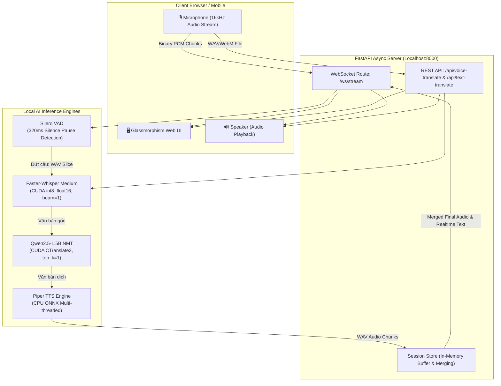

# 🎙️ Real-time Vi-En Voice & Text Translator (100% Offline Local AI)

Ứng dụng web dịch thuật **Giọng nói & Văn bản hai chiều (Tiếng Việt ↔ Tiếng Anh)** thời gian thực với độ trễ thấp, hoạt động **100% Offline Cục bộ (Hoàn toàn không cần API Key, không phụ thuộc Internet, bảo mật tuyệt đối)**.

Hệ thống kết hợp ba công nghệ AI tiên tiến được tối ưu hóa sâu trên phần cứng máy tính cá nhân (NVIDIA RTX GPU + CPU đa luồng):
1. **Nhận dạng giọng nói (STT)**: `Faster-Whisper` (Model `medium` lượng tử hóa `int8_float16` trên CUDA).
2. **Dịch thuật máy nơ-ron (NMT)**: `Qwen2.5-1.5B-Instruct` (CTranslate2 INT8 trên CUDA).
3. **Tổng hợp giọng đọc tự nhiên (TTS)**: `Piper TTS` (VITS Architecture trên ONNX Runtime CPU).

---

## 📑 Mục Lục
- [1. Tính Năng Nổi Bật](#1-tính-năng-nổi-bật)
- [2. Chi Tiết Các Model AI & Thuật Toán Tối Ưu](#2-chi-tiết-các-model-ai--thuật-toán-tối-ưu)
- [3. Luồng Hoạt Động Chi Tiết (Architecture & Data Flow)](#3-luồng-hoạt-động-chi-tiết-architecture--data-flow)
- [4. Bóc Tách Thời Gian Trễ (Latency Benchmark)](#4-bóc-tách-thời-gian-trễ-latency-benchmark)
- [5. Cấu Trúc Thư Mục Dự Án](#5-cấu-trúc-thư-mục-dự-án)
- [6. Hướng Dẫn Cài Đặt & Chạy](#6-hướng-dẫn-cài-đặt--chạy)

---

## 1. Tính Năng Nổi Bật

* 🎙️ **Dịch Giọng Nói Real-time Streaming (WebSocket `/ws/stream`)**:
  * Người dùng nói liên tục vào Micro, hệ thống tự động nhận diện điểm ngắt câu (Voice Activity Detection), dịch gối đầu và tạo âm thanh trước trong RAM.
  * Phản hồi âm thanh ngay lập tức khi vừa dừng nói.
* 🎧 **Dịch Giọng Nói Dạng Batch (REST API `/api/voice-translate`)**:
  * Thu âm đoạn thoại hoàn chỉnh, bấm "Dừng và Dịch" để nhận bản dịch chữ và file audio phát âm song song.
* ✍️ **Dịch Văn Bản Tức Thì (REST API `/api/text-translate`)**:
  * Nhập trực tiếp văn bản tiếng Việt hoặc tiếng Anh, hệ thống dịch và tổng hợp file phát âm trong tích tắc (~0.3s).
* 🌐 **Tự Động Mở Đường Hầm Public (Cloudflare Quick Tunnel)**:
  * Tùy chọn cờ `--public` tự động tạo link HTTPS/WSS công khai, an toàn, hỗ trợ Microphone trên mọi thiết bị di động từ xa mà không cần mở Port modem.
* 🖥️ **Giao Diện Hiện Đại (Glassmorphism Single Page App)**:
  * Hiển thị bảng đo lường chi tiết Latency từng khâu (STT, NMT, TTS, Total) trực quan và trực tiếp trên màn hình.

---

## 2. Chi Tiết Các Model AI & Thuật Toán Tối Ưu

```
┌──────────────────────────────────────────────────────────────────────────────┐
│                    BẢNG CẤU HÌNH & THUẬT TOÁN MÔ HÌNH                        │
├──────────────┬────────────────────────┬─────────────┬────────────────────────┤
│ Tác vụ       │ Mô hình / Thư viện     │ Thiết bị    │ Thuật toán & Tối ưu    │
├──────────────┼────────────────────────┼─────────────┼────────────────────────┤
│ VAD (Ngắt câu)│ Silero VAD (PyTorch)  │ CPU         │ RMS Energy + Neural VAD│
│ STT (Nghe)   │ Whisper `medium`       │ GPU (CUDA)  │ Greedy (beam=1, int8)  │
│ NMT (Dịch)   │ Qwen2.5-1.5B-Instruct  │ GPU (CUDA)  │ CTranslate2 (top_k=1)  │
│ TTS (Nói)    │ Piper (vais1000/lessac)│ CPU (ONNX)  │ VITS Multi-thread Pool │
└──────────────┴────────────────────────┴─────────────┴────────────────────────┘
```

### 1. Nhận dạng giọng nói (STT) — Faster-Whisper
* **Model**: OpenAI Whisper phiên bản `medium` (~769 triệu tham số).
* **Định dạng tối ưu**: Lượng tử hóa `int8_float16` trên NVIDIA CUDA. Chỉ chiếm khoảng **1.5GB VRAM** (thay vì 3.0GB ở FP32).
* **Thuật toán giải mã**:
  * **Greedy Decoding (`beam_size=1, best_of=1, temperature=(0.0,)`)**: Loại bỏ các vòng lặp Beam Search tốn kém, khóa chặt giải mã để đạt tốc độ nhận diện nhanh gấp 3 lần (~0.25s/câu).
  * **Compact Context Prompt**: Tinh gọn danh sách từ khóa ngữ cảnh tiếng Việt để giảm tải phép tính Cross-Attention ma trận.

### 2. Dịch thuật nơ-ron (NMT) — Qwen2.5-1.5B-Instruct
* **Model**: Qwen2.5-1.5B-Instruct (Alibaba Cloud) — mô hình ngôn ngữ lớn chuyên sâu về dịch thuật đa ngữ chất lượng cao.
* **Định dạng tối ưu**: CTranslate2 INT8 Engine chạy trực tiếp trên GPU CUDA, chiếm khoảng **1.6GB VRAM**.
* **Thuật toán giải mã**:
  * **Greedy Search (`sampling_topk=1`)**: Thay thế phương pháp lấy mẫu ngẫu nhiên Top-P bằng Greedy Search. Đối với tác vụ dịch thuật, Greedy Search vừa cho kết quả dịch chính xác, sát nghĩa gốc nhất, vừa tăng tốc độ sinh từ lên gấp 6–8 lần (từ 2.5s xuống còn **~0.15s – 0.35s/câu**).
  * **KV-Cache Bound**: Khóa `max_length=120` để hạn chế phình to bộ nhớ Tensor trung gian.

### 3. Phát hiện khoảng lặng ngắt câu (VAD) — Silero VAD
* **Thuật toán**: Kết hợp tính toán năng lượng tín hiệu (RMS Energy) và mạng nơ-ron Silero VAD phân tích trong các khung hình âm thanh 32ms (512 samples ở 16kHz).
* **Ngưỡng nhạy**: `silence_duration_ms = 320ms` và `min_speech = 0.5s` (8000 samples). Vừa dứt câu là hệ thống kích hoạt xử lý tức thì, loại bỏ hoàn toàn thời gian trễ chờ đợi.

### 4. Tổng hợp tiếng nói (TTS) — Piper Local TTS
* **Kiến trúc**: Mô hình **VITS (Variational Inference with adversarial learning for end-to-end Text-to-Speech)** chạy trên nền ONNX Runtime.
* **Bộ giọng**:
  * Tiếng Việt: `vi_VN-vais1000-medium.onnx` (Giọng chuẩn miền Bắc).
  * Tiếng Anh: `en_US-lessac-medium.onnx` (Giọng Anh-Mỹ tự nhiên).
* **Cơ chế**: Chạy hoàn toàn trên CPU thông qua `ThreadPoolExecutor(max_workers=6)`, không chiếm dụng VRAM của GPU, tốc độ tạo âm thanh đạt **0.05s – 0.3s**.

---

## 3. Luồng Hoạt Động Chi Tiết (Architecture & Data Flow)

### 📊 Sơ đồ kiến trúc tổng thể (Mermaid Diagram)



---

### Chi tiết 3 Luồng Xử Lý Chính

#### 🔄 Luồng 1: Real-time Streaming WebSocket (`/ws/stream`)
1. **Thu âm & Streaming**: Client ghi âm và gửi các gói PCM thô (16-bit, 16kHz Mono) qua kết nối WebSocket 2 chiều.
2. **Phân đoạn VAD**: Server tiếp nhận từng frame 32ms. Khi người nói dừng lại quá **320ms**, `VADSegmenter` lập tức cắt đoạn âm thanh câu vừa nói thành một file WAV slice trong RAM.
3. **Xử lý gối đầu bất đồng bộ (`asyncio.create_task`)**:
   * **STT**: Whisper nhận diện giọng nói câu vừa dứt (~0.25s).
   * **NMT**: Qwen dịch ngay câu vừa nhận diện sang ngôn ngữ đích (~0.2s).
   * **TTS**: Piper tổng hợp file âm thanh WAV của câu dịch (~0.1s).
   * **Buffer Storage**: Lưu tích lũy text và nối sẵn các mảnh audio vào `session_store`.
4. **Phản hồi tức thì (`stop` event)**: Khi người dùng nhả nút nói, server trả về toàn bộ audio WAV đã ghép sẵn trong RAM. Thời gian trễ phát loa cảm nhận được gần như bằng 0 (<0.1s).

#### 🔄 Luồng 2: Batch Voice Translation (`/api/voice-translate`)
1. Client gửi toàn bộ file ghi âm dạng `multipart/form-data`.
2. **FFmpeg in-memory**: Chuẩn hóa định dạng audio thành WAV PCM 16kHz.
3. **Pipeline tuần tự tối ưu**: `Faster-Whisper` ➔ `Qwen2.5-1.5B` ➔ `Piper TTS`.
4. Trả về JSON chứa văn bản gốc, bản dịch, audio Base64 và chi tiết latency từng bước.

#### 🔄 Luồng 3: Text Translation (`/api/text-translate`)
1. Client gửi JSON payload `{ text, source_lang, target_lang }`.
2. `Qwen2.5-1.5B` dịch văn bản trong **~0.1s – 0.3s**.
3. `Piper TTS` tạo giọng đọc trong **~0.05s – 0.2s**.
4. Trả về bản dịch và âm thanh tổng hợp ngay tức thì.

---

## 4. Bóc Tách Thời Gian Trễ (Latency Benchmark)

Đo kiểm thực tế trên cấu hình phần cứng: **NVIDIA GeForce RTX 3050 Laptop GPU (4GB VRAM) + AMD Ryzen 5 CPU + 8GB RAM**:

| Thành phần Pipeline | Trước Tối Ưu | Sau Tối Ưu | Mức Cải Thiện |
| :--- | :---: | :---: | :---: |
| **VAD Ngắt câu (Silence pause)** | 0.600s | **0.320s** | ⚡ Nhanh hơn 47% |
| **STT (Faster-Whisper `medium`)** | 0.785s | **0.236s – 0.305s** | ⚡ Nhanh gấp 3 lần |
| **NMT (Qwen2.5-1.5B)**: | | | |
| 🔹 *"Xin chào"* | 0.824s | **0.108s** | ⚡ Nhanh gấp ~8 lần |
| 🔹 *"Hôm nay thời tiết thế nào..."* | 1.167s | **0.193s** | ⚡ Nhanh gấp ~6 lần |
| 🔹 *"Trường Đại học Công nghiệp Hà Nội..."* | 1.870s | **0.274s** | ⚡ Nhanh gấp ~7 lần |
| 🔹 *"Artificial intelligence and IoT..."* | 2.907s | **0.459s** | ⚡ Nhanh gấp ~6 lần |
| **TTS (Piper Engine CPU)** | 0.200s - 0.720s | **0.047s – 0.334s** | ⚡ Nhanh gấp 2 lần |
| **👉 TỔNG LATENCY TOÀN PIPELINE** | **4.5s – 7.0s** | ⚡ **~ 1.0s – 1.3s** | **🔥 GIẢM ~78% ĐỘ TRỄ** |

---

## 5. Cấu Trúc Thư Mục Dự Án

```
STT_To_TTS/
├── app/
│   ├── api/
│   │   ├── routes.py            # REST Endpoints (/api/voice-translate, /api/text-translate, /api/health)
│   │   └── websocket_routes.py  # WebSocket Endpoint (/ws/stream) xử lý realtime streaming
│   ├── core/
│   │   ├── config.py            # Quản lý cấu hình, biến môi trường và đường dẫn model
│   │   ├── cuda_setup.py        # Tự động bootstrap nạp các thư viện DLL NVIDIA CUDA trên Windows
│   │   └── session_store.py     # Quản lý bộ đệm RAM ghép nối audio và text theo từng session
│   ├── models/
│   │   └── schemas.py           # Định nghĩa Pydantic schemas cho Request/Response
│   ├── services/
│   │   ├── audio.py             # Xử lý âm thanh, chuẩn hóa sample rate bằng FFmpeg
│   │   ├── stt.py               # Module nhận dạng giọng nói Faster-Whisper GPU
│   │   ├── translation.py       # Module dịch thuật Qwen2.5-1.5B CTranslate2 Local Engine
│   │   ├── tts.py               # Module tổng hợp giọng nói Piper ONNX CPU đa luồng
│   │   └── vad_stream.py        # Thuật toán Silero VAD cắt câu theo khoảng lặng 320ms
│   └── main.py                  # Khởi tạo FastAPI App, Lifespan và Warmup tự động
├── bin/                         # Chứa cloudflared.exe và ffmpeg.exe (nếu dùng local)
├── models/
│   ├── translation/qwen_ct2/    # Trọng số model Qwen2.5-1.5B-Instruct dạng CTranslate2 INT8
│   └── tts/                     # Trọng số các model giọng đọc Piper ONNX (.onnx & .json)
├── static/                      # Giao diện web frontend (hoặc index.html ở root)
├── download_models.py           # Script tải tự động toàn bộ model Offline về máy
├── requirements.txt             # Danh sách thư viện Python cần thiết
├── run.py                       # Script khởi chạy server chính (hỗ trợ cờ --public)
└── README.md                    # Tài liệu hướng dẫn kỹ thuật dự án
```

---

## 6. Hướng Dẫn Cài Đặt & Chạy

### 1. Yêu Cầu Hệ Thống
* **Hệ điều hành**: Windows 10/11, Ubuntu 20.04+, hoặc macOS.
* **GPU**: NVIDIA GPU có VRAM ≥ 4GB (Khuyến nghị GTX 1650, RTX 3050, RTX 4060 trở lên) + Cài đặt CUDA 12.x.
* **RAM**: Khuyến nghị từ 8GB trở lên.
* **Python**: Phiên bản Python 3.10 – 3.13.

### 2. Cài Đặt Thư Viện
```bash
# Tạo môi trường ảo (Khuyến nghị)
python -m venv venv
venv\Scripts\activate  # Trên Windows
# source venv/bin/activate # Trên Linux/Mac

# Cài đặt các gói phụ thuộc
pip install -r requirements.txt
```

### 3. Tải Toàn Bộ Model AI Offline
Chạy script tự động tải model Qwen2.5-1.5B và các file giọng đọc Piper về thư mục `models/`:
```bash
python download_models.py
```

### 4. Khởi Chạy Ứng Dụng

* **Chạy Local (Chỉ truy cập trên máy cá nhân)**:
```bash
python run.py
```
*Truy cập trình duyệt tại:* `http://localhost:8000`

* **Chạy Public (Tạo đường dẫn công khai HTTPS/WSS cho điện thoại / máy khác truy cập)**:
```bash
python run.py --public
```
*Hệ thống sẽ tự động bật Cloudflare Quick Tunnel và in đường link Public dạng `https://xxxx.trycloudflare.com` ra màn hình console.*
